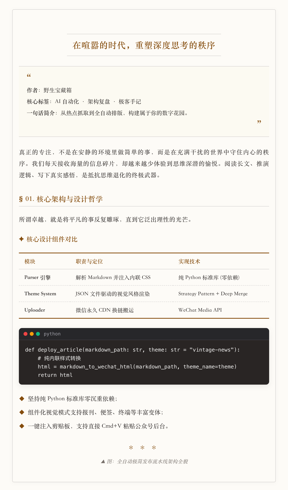
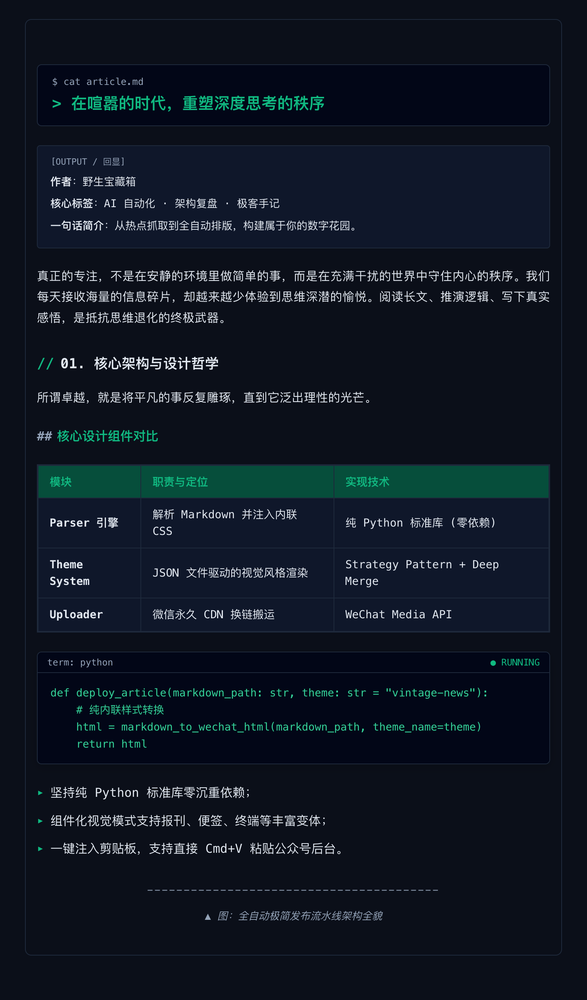
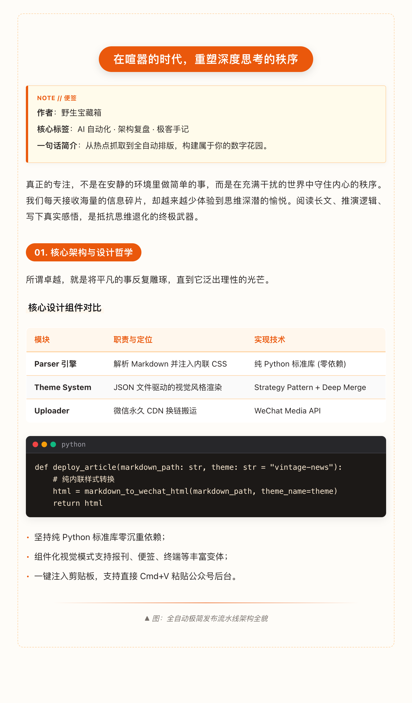
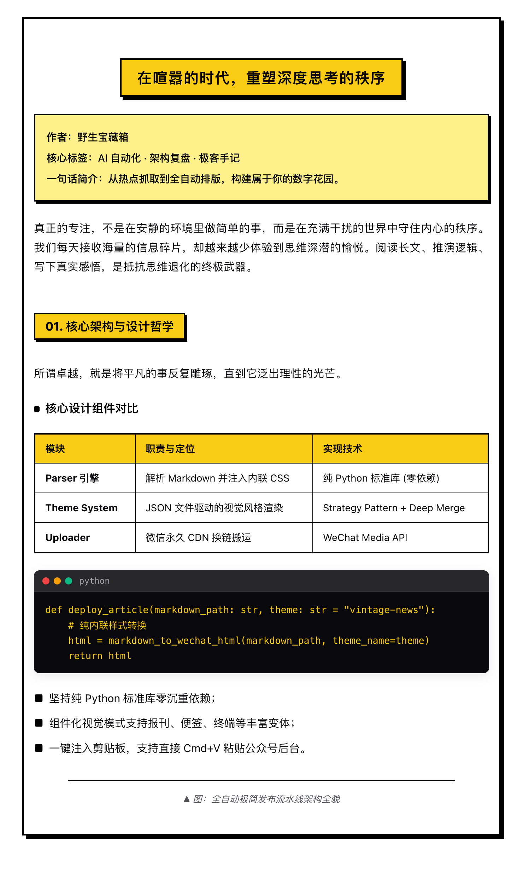
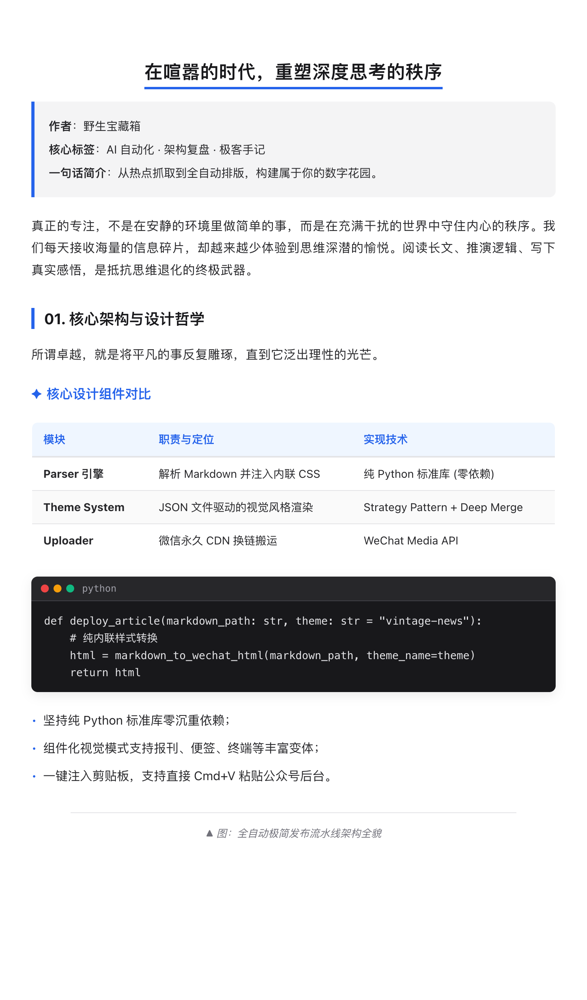
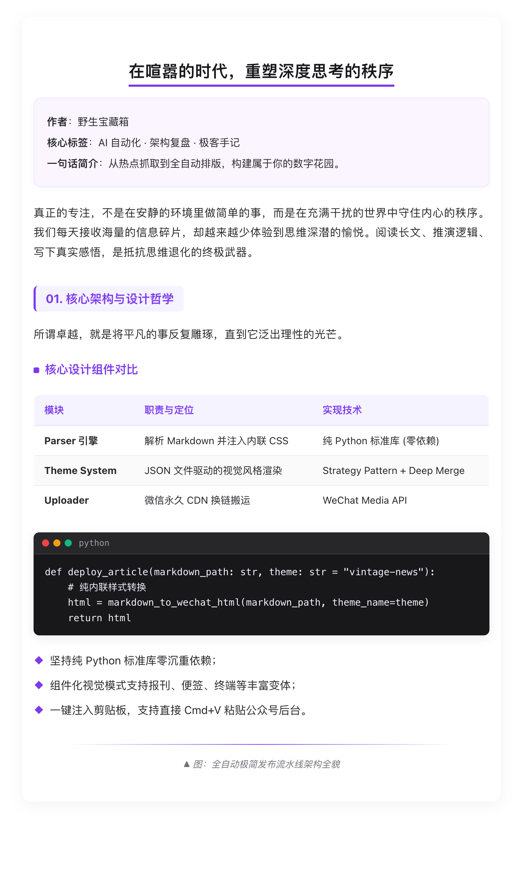
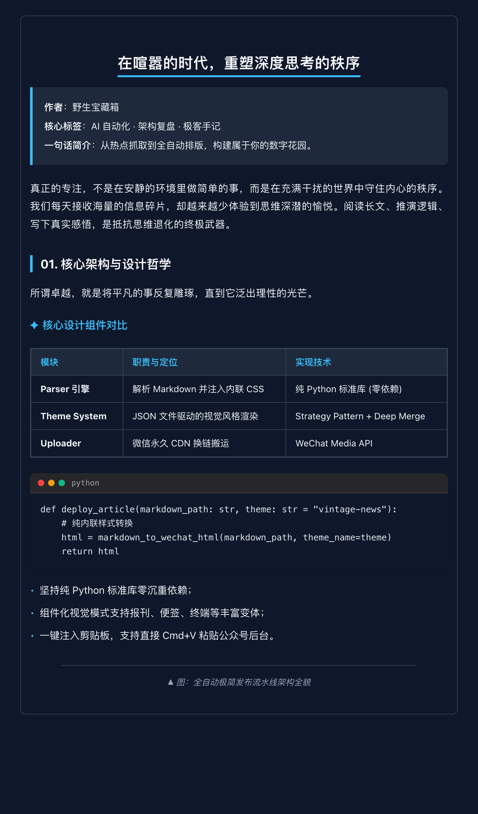
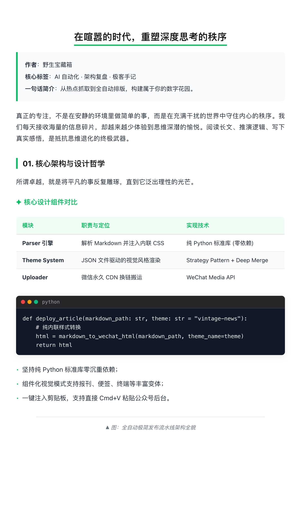

# Vibe Coding 记：我用 AI 徒手搓了个微信全风格排版引擎

> **作者**：野生宝藏箱  
> **模式**：纯纯的 Vibe Coding（灵感直觉 -> 与 AI 对话 -> 秒级落地）  
> **排版主题**：terminal-geek 极客终端（全黑底 + 等宽字体 + 终端回显）  
> **一句话简介**：写文十分钟，排版两小时？告别精神内耗，一个下午搓出属于极客的排版神器。

不知你是否也经历过这种绝望：

在本地编辑器里用 Markdown 敲完一篇深度好文，文思泉涌，配图完美，等宽架构图规规整整。  
然而，当你满怀期待地全选、复制、粘贴进微信公众平台后台的那一瞬间——

**啪，快乐没了。**

样式被剥离殆尽，段落拥挤成一坨；精心画的 ASCII 架构图在手机预览里被挤得面目全非；开头的导读引言被硬生生切成了三四个断断续续的灰框框；代码块没有高亮，像一堆灰头土脸的白开水；更别提那些动不动防盗链变红叉的图片了……

传统程序员的做法：翻出微信富文本规则，查 CSS 过滤白名单，写正则写到半夜两点，头秃叹气。

而今天，作为一名现代 **Vibe Coder**，我的选择是：  
**泡一杯咖啡，放着 Lo-Fi 音乐，打开终端，跟 AI 说：“受不了了，来，我们徒手搓一个微信公众号排版引擎，今天下午就要用上！”**

---

## 01. Vibe 起步：拒绝重型堆栈，只要极致的纯净

很多排版工具动不动就要装一整套 Node.js 环境、拖着几百兆的 Chromium 无头浏览器，或者引入一堆臃肿的第三方库。

但我想要的 Vibe 是：**轻巧、即开即用、零负担**。  
就像当年 Unix 哲学里的纯粹小工具一样，随手在终端里敲一行命令，毫秒级出结果。

我和 AI 达成了第一条共识：**核心代码只用 Python 标准库，零外部依赖**。

```bash
# 随手在终端里一敲，毫秒级编译
md2wx article.md -t terminal-geek --clip
```

整个过程行云流水：
- 微信会过滤 `<style>` 标签？那就让 AI 把所有的 CSS 规则在 AST 解析阶段直接**物理内嵌（Inline Style）**到每一个 HTML 标签上；
- 微信把连续多行的 `> ` 引文切碎？AI 秒写了一个聚合状态机，把连续引言打包成一个极具层次感的导读卡片；
- 要把排版好的内容弄进微信？调用系统底层的 `osascript`，直接把富文本塞进 macOS 剪贴板。

写完文档，在终端敲一下回车，直接在微信公众号后台按一下 **Cmd + V**，带质感的排版瞬间展开！

这种无需等待、无需折腾环境的心流感，就是 Vibe Coding 的快感所在。

---

## 02. 灵魂提问：“只换颜色，那不叫主题！”

初版跑通后，我试了试几个配色。虽然好看，但总觉得少了点什么。市面上很多所谓的排版工具，“换主题”其实就是换个 Accent 颜色，红的变绿的，绿的变蓝的，骨架完全千篇一律。

而在此之前，我们刚做完一站式社交卡片生成器 **WePost**。在 WePost 里，极简杂志、复古报刊、日系便签、先锋潮流……每个模板都有自己的骨架和灵魂。

于是我对 AI 提出了核心灵魂需求：  
**“主题可以丰富一些，不只是换个颜色，就像我们 WePost 卡片一样，不同的主题风格差异应该更大！”**

AI 马上心领神会，我们立即展开了第二轮 Vibe 迭代：**把主题彻底抽象为独立文件驱动（JSON Theme Files），并建立组件视觉渲染矩阵**！

我们不仅定义调色板，更定义了每一个 Markdown 组件在不同风格下的形态。

下面，带大家直观看看我们一个下午折腾出来的几套差异巨大的视觉风格：

### ✦ 风格 1：复古报刊 (vintage-news)

浅牛皮纸微黄底色、优雅粗衬线体、古典对称双细线居中标题与学术三线表，自带浓厚的人文书卷气息与深度思考质感：


*▲ 图：vintage-news 复古报刊风格，古典双细线与学术三线表*

### ✦ 风格 2：极客终端 (terminal-geek)

这也是你当前阅读的这篇文章所使用的风格！曜石深黑底色、等宽代码字体、`$ cat` 命令行标题与终端运行回显：


*▲ 图：terminal-geek 极客终端风格，曜石深黑底色与运行状态条*

### ✦ 风格 3：温暖便签 (warm-memo)

日系奶油柔色系、胶囊圆角色块、日系便签贴纸感与治愈手作排版，非常适合读书笔记、生活感悟与碎碎念：


*▲ 图：warm-memo 温暖便签风格，胶囊色块与日系 NOTE 便签贴纸*

### ✦ 风格 4：先锋野兽派 (acid-bold)

高反差粗黑线框、纯黑 4px 硬实投影、粗黑方块列表与醒目大色块，波普视觉冲击力直接拉满：


*▲ 图：acid-bold 先锋野兽派风格，2.5px 粗黑边框与黑色硬投影*

### ✦ 风格 5：现代科技蓝 (tech-blue · 默认)

经典硅谷现代科技风，下划粗线、左侧竖条与 Mac 红黄绿圆点代码框，开发者手记与架构复盘首选：


*▲ 图：tech-blue 现代科技蓝，经典硅谷极客排版*

### ✦ 风格 6：先锋优雅紫 (elegant-purple)

现代雅致紫调，微阴影悬浮质感卡片与柔和色块，适合设计美学、独立思考与产品体验发布：


*▲ 图：elegant-purple 先锋优雅紫，现代雅致紫调与悬浮卡片*

### ✦ 风格 7：暗黑极客风 (dark-night)

沉浸暗黑质感，深蓝灰底色与冷冽荧光蓝，适合深夜阅读与硬核技术剖析：


*▲ 图：dark-night 暗黑极客风，深蓝灰底色与冷冽荧光蓝*

### ✦ 风格 8：微信生态绿 (wechat-green)

经典微信官方绿调，严谨清爽规范排版，适合行业资讯速递、官方发布与社群运营：


*▲ 图：wechat-green 微信生态绿，官方严谨规范排版*

---

## 03. 翻车现场：那个价值连城的 `<style>` 陷阱

当然，Vibe Coding 并不等于一路平推，偶尔的“翻车与踩坑”反而是最有趣的插曲。

刚才我第一次把文章推送到微信草稿箱时，打开预览一看：  
**“咦？怎么只有第一段？后面几万字全部蒸发了？！”**

我和 AI 立刻调出微信草稿箱的底层 API 数据进行比对，结果令人拍案叫绝：

原来，我们在文章正文里写了这么一句：  
`- 对 <style> 标签与外链 CSS 的格杀勿论……`

在最初的简易解析逻辑里，反引号内的行内代码没有做严格的 HTML 字符转义，直接输出了：  
`<code><style></code>`

而**微信公众平台的安全清理器对 `<style>` 标签极其敏感且粗暴**：一旦在富文本里看到未转义的 `<style>`，后端判定存在潜在未闭合样式，**直接把从 `<style>` 开始直到文末的所有 HTML 节点全部一刀切截断！**

这就导致微信以为我们整篇文章后面全都是 CSS 样式，统统丢弃了！

破案之后，我们两人相视一笑（虽然隔着屏幕）。AI 迅速引入了工业级的行内 Token 语法保护机制：把所有行内代码、标题、文本中的 `<`、`>`、`&` 统统严密转义为 `&lt;`、`&gt;`、`&amp;`。

单测跑通，重新推送——**文章长度瞬间从被截断的 3,300 字符飙升到 29,000 字符，全文 100% 完美复活！**

把排障和修复也当成一种心流，这种与 AI 协同解决真实世界边界 bug 的感觉，实在太爽了。

---

## 04. 极客工作流：两行命令的从容

现在，我的日常写作工作流变成了这样：

在本地 Obsidian 里放飞自我，写完一篇随笔或复盘，保存。

想在公众号后台手动贴入？
```bash
md2wx my_article.md -t vintage-news --clip
```
回车，去公众号后台按 Cmd+V，复古报刊的排版瞬间映入眼帘。

想一键直奔草稿箱，连图片都不想手动传？
```bash
md2wx my_article.md -t terminal-geek --publish --cover cover.png
```
工具自动把正文所有本地插图同步至微信官方 CDN、自动换链、绑定封面素材，几秒钟后，草稿箱里已经静静躺着这篇排版精美的大作，还贴心地输出了预览链接。

---

## 05. 写在最后：Vibe Coding 究竟改变了什么？

常有人问：AI 编程到底改变了什么？是写代码更快了吗？

在我看来，Vibe Coding 绝不是偷懒，而是一种**解放创造力的新型创作状态**。

在过去，实现一个全功能、多主题、支持剪贴板与微信 API 的排版工具，你可能需要规划好几天、查几天文档、踩好几天的环境坑。许多很棒的灵感，往往就在这些无休止的“琐碎脏活”中被消磨殆尽了。

而在 AI 时代，你可以把所有的体力劳动、正则推演、API 对接交给懂你的 AI 伙伴。**人类创作者退回到指挥家与审美把控者的位置：你只需要提供直觉、品味、创意与方向。**

灵感产生的那一刻，代码就已经在奔跑。

这篇记录，送给所有在 AI 时代探索可能性的 Vibe Coders。

- 项目仓库：[https://github.com/zaneven/MD2WX](https://github.com/zaneven/MD2WX)  
- 零依赖 · 9大独立视觉骨架主题 · 支持自定义扩展 · 一键草稿发布
