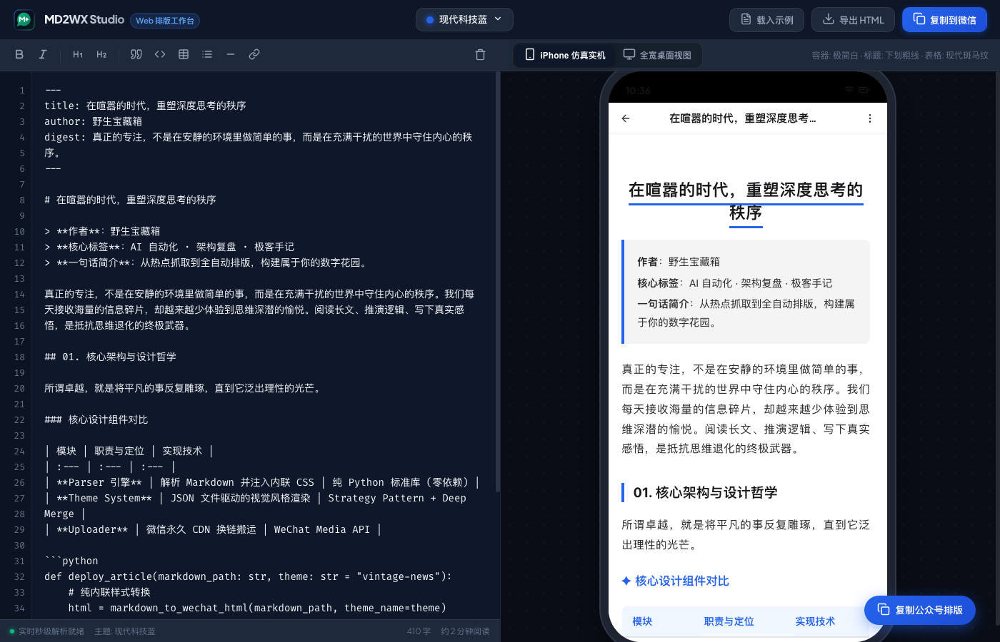
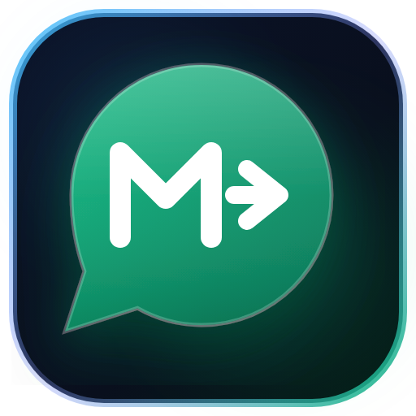

# Vibe Coding 记（下篇）：从 CLI 跃迁到 Web 工作台，与 AI 结对打造 MD2WX Studio 与全新品牌

> **作者**：野生宝藏箱  
> **模式**：纯纯的 Vibe Coding（灵感直觉 -> 与 AI 对话 -> 秒级落地）  
> **排版主题**：tech-blue 现代科技蓝（硅谷开发者手记 · Mac 圆点代码框）  
> **一句话简介**：从纯命令行到可视化网页工作台，把微信排版体验推向极致。

昨天，我们用纯 Python 标准库徒手搓出了 **MD2WX** 核心引擎，实现了零外部重型依赖、9 大独立视觉骨架主题，以及剪贴板富文本注入与草稿箱直推。

文章发出来后，收到了很多创作者的热烈反馈。但紧接着，好几个高频使用场景的灵魂拷问也接踵而至：

> *“平时写完文章就想在网页里直接贴 Markdown，实时看着效果挑主题，能不能做个 Web 网页版？”*  
> *“公众号 90% 的读者都在手机上看，桌面端看着挺好看，手机上一打开经常被挤得面目全非，能不能模拟真机效果？”*  
> *“能不能不要搞复杂的后端服务器？我就想要一个随开随用、完全不用担心文章泄露的本地前端工具！”*

**创作者的直觉，就是最好的产品需求清单。**

今天早上一杯黑咖啡下肚，我再次敲开终端对 AI 说：  
**“今天我们搞个大的——给 MD2WX 做一个纯前端驱动、带 iPhone 真机仿真、体验媲美原生桌面应用的 Web Studio 工作台，顺便把全套品牌 Logo 和 Favicon 彻底重塑！”**

以下是今天这场极具心流感的 Vibe Coding 开发全记录。

---

## 01. 确立铁律：纯前端、零依赖与绝对数据安全

做一个 Web 排版工具，很多人的第一反应是：写个 Flask/FastAPI 后端，前端发请求给后端解析，后端返回 HTML，前端再渲染。

但我和 AI 在五分钟内就否决了这个平庸的架构，并确立了三条硬核铁律：

1. **纯前端客户端架构（Zero Backend Dependency）**：
   所有的 Markdown AST 词法解析、内联样式注入、主题矩阵计算，必须 100% 运行在用户的浏览器本地 JavaScript 引擎中。不设任何后端中转服务，没有冷启动等待，毫秒级即打即显。
2. **绝对的数据隐私与安全（Local Only）**：
   创作者写未公开的文章、公司内参、技术机密，最忌讳的是把草稿上传到第三方服务器。在纯前端模式下，文章内容物理隔绝在浏览器内存内，网络断网也能离线使用。
3. **严格的矢量规范（全站严禁 Emoji）**：
   为了保持专业科技感与跨平台一致性，全站所有按钮、工具栏、指示图标全面采用精美 24x24 矢量 SVG 图标，禁止使用任何操作系统 Emoji，杜绝不同手机端渲染差异。

---

## 02. 核心架构：前端解析引擎与主题矩阵 1:1 对标

要把 Python 的解析引擎移植到浏览器，最简单的做法是引入庞大的第三方 Markdown 渲染库，但那往往会导致包体积膨胀、样式难以深度内联。

我们选择让 AI 将 Python 版的核心解析算法纯手工重写为轻量独立的 ES6 模块：

### ✦ 连续多行引文聚合器 (Blockquote Aggregator)
微信公众平台最恶心的坑之一，就是把连续的 `> 字段：值` 切成四分五裂的灰色小方块。前端引擎同样保留了状态机聚合逻辑：

```javascript
// web/src/core/parser.js 核心片段
if (trimmed.startsWith('>')) {
  const quoteLines = [];
  while (i < lines.length && lines[i].trim().startsWith('>')) {
    quoteLines.push(lines[i].trim().replace(/^>\s*/, ''));
    i++;
  }
  // 聚合输出为一个带主题色光边与呼吸感内边距的高质感导读卡片
  htmlParts.push(renderQuoteBlock(quoteLines, theme));
  continue;
}
```

### ✦ 9 款独立视觉骨架主题全量内置
我们把 Python 版所有独立 JSON 主题抽象为前端的主题注册表 `themes.js`，包含：
- **现代科技蓝 (tech-blue)**：硅谷开发者风格，Mac 三色指示灯代码块；
- **复古报刊 (vintage-news)**：优雅古典粗衬线体、双细线居中 H1、学术三线表与名言大引号；
- **极客终端 (terminal-geek)**：曜石深黑底色、等宽代码字体、`$ cat` 命令行标题与终端运行回显；
- **温暖便签 (warm-memo)**：日系奶油柔色系、胶囊圆角色块与治愈贴纸；
- **先锋野兽派 (acid-bold)**：粗黑线框、纯黑 4px 硬实投影与高对比波普色块；
- **先锋优雅紫、暗黑极客风、温暖活力橙、微信生态绿**……

在工作台顶部的下拉菜单中轻点任意主题，编辑器与预览器在 **0 毫秒**内无感切换，真正实现了“卡片级骨架差异”。

---

## 03. iPhone 仿真实机：消灭“手机端排版灾难”

为什么许多排版在电脑看很美，发到手机上就翻车？  
因为 PC 显示器动辄 1920px 宽度，而用户的 iPhone 视口实际只有 **375px ~ 390px**！一旦字体过大、内边距过窄、或者等宽字符超长，就会在手机上发生残酷的折行。

为了彻底消灭这种灾难，我们在 Web Studio 右侧打造了**深度仿真的 iPhone 实机视窗**：

- **硬件级细节还原**：顶端悬浮的「灵动岛（Dynamic Island）」、包含实时时钟、WiFi 矢量信号与满格电池电量的「iOS 状态栏」；
- **真实公众号环境仿真**：高仿微信图文顶栏的返回键、公众号标题与右上角三个小圆点菜单；
- **外壳智能感知联动**：当你切换到「极客终端」或「暗黑极客」等深色主题时，实机状态栏与外壳自动协调切换为暗夜模式，带来极度沉浸的视觉体验；
- **双视口一键切换**：支持在「iPhone 仿真实机 (390px)」与「宽屏全览 (740px)」之间自由切换。


*▲ 图：MD2WX Web Studio 工作台，左侧高效输入与格式工具栏，右侧 iPhone 仿真预览*

---

## 04. 原生微信剪贴板：从浏览器到公众号后台的无缝跃迁

做 Web 排版工具，最大的技术难点不是把 Markdown 转成 HTML，而是：**如何让用户复制出来的内容，粘贴到微信后台时依然完好无损？**

如果只用常规的文本复制，贴进微信就是一堆裸 HTML 代码；如果用带 `<style>` 的富文本，微信的后台过滤器会瞬间把样式清洗得干干净净。

我们利用现代浏览器标准的 `navigator.clipboard` API 实现了纯内联富文本的物理注入：

```javascript
// web/src/core/clipboard.js 核心复制逻辑
export async function copyToWechat(htmlContent, plainText) {
  const blobHtml = new Blob([htmlContent], { type: 'text/html' });
  const blobText = new Blob([plainText], { type: 'text/plain' });

  const data = [new ClipboardItem({
    'text/html': blobHtml,
    'text/plain': blobText
  })];

  await navigator.clipboard.write(data);
}
```

现在的工作流顺滑到了极致：
在网页左侧粘贴或编辑 Markdown，右侧实时预览满意后，点击右上角的 **「复制到微信」**。  
切到微信公众号后台编辑器，按下 **Cmd + V（Windows 用户 Ctrl + V）**——**所有标题下划线、Mac 代码框圆点、学术三线表、边条导读卡片瞬间原汁原味展开！**

---

## 05. 品牌重塑：当 Markdown 遇见微信（Logo & Favicon）

在打造 Web Studio 的过程中，我们发现浏览器标签页上还缺少一个真正代表 MD2WX 精神的标志性徽标。

市面上的很多工具要么直接拿 Markdown 官方图标，要么随手放个微信绿标。但 MD2WX 的本质是 **从 Markdown 纯文本向微信公众号高质感排版的跨越与升维**。

我们与 AI 展开了数轮矢量推演与多尺寸视认性对比，最终定稿了全新的品牌视觉体系：


*▲ 图：MD2WX 全新 Master 品牌徽标*

### ✦ 视觉隐喻的设计哲学
1. **极光翠绿气泡（WeChat 语义）**：  
   以标志性的微信翡翠绿（`#10B981` ➔ `#047857`）结合微斜切光感 Bevel 呈现立体的微信聊天气泡，亲和而具有纵深感；
2. **纯白几何 M（Markdown 语义）**：  
   气泡内部雕刻高对比度的纯白几何 `M` 字符，象征标准 Markdown 的极简与结构之美；
3. **向前跃迁转换箭头（"2" / Transition）**：  
   在 `M` 的右侧紧密连缀一道向前跃迁的 `→` 转换箭头，直观表达“2”（to）、转换、升维与流动；
4. **深邃科技基底（Master Emblem）**：  
   主徽标采用 iOS 平滑曲率（Squircle）外壳，辅以 Obsidian 深空黑底与赛博天青蓝（`#38BDF8`）至微信翠绿的微光渐变边框。

### ✦ 像素级 Favicon 调校难题
在 16x16 与 32x32 的浏览器极小标签页下，外部的黑框和细线条容易糊成一团。为此，我们专门针对 Favicon 进行了**无边框独立剪裁优化 (`favicon.svg`)**：
- 去除外层方框，只保留高对比度的翠绿气泡本体；
- 将内部 `M` 和箭头的笔触加粗至 2.3px；
- 无论用户使用的是 Chrome、Safari 还是 Edge，无论标签栏处于深色还是浅色模式，绿色的气泡与纯白标识都如同原生桌面应用般清透锐利！

---

## 06. 命令行与 Web 一键联动

除了通过浏览器直接访问外，我们还把 Web Studio 深度集成进了 Python CLI 工具：

```bash
# 在终端中敲入一行命令，即可自动拉起本地 Web 工作台并在浏览器打开
md2wx --web
```

不管是习惯在 Vim / VSCode 里随手敲命令的一行流极客，还是喜欢在浏览器里开着实机预览所见即所得的创作者，MD2WX 都能提供毫无割裂感的统一体验。

---

## 07. 今日 Vibe Coding 复盘

回顾今天这一场从早到晚的迭代：
- 上午：确立纯前端架构，完成核心解析引擎与 9 套独立视觉骨架主题的 JS 移植；
- 中午：构建 iPhone 仿真实机、动态岛、双视口切换与富文本原生剪贴板注入；
- 下午：全站矢量 SVG 图标化（严禁 Emoji），设计全新的品牌 Logo、Favicon 矩阵与全套响应式设计；
- 傍晚：完成 Vite 生产打包验证、13 项单测回归，代码全量推送 GitHub。

在过去，这样一套包含客户端跨平台构建、设计资产重塑、移动端仿真与排版引擎的前端工程，往往需要一个小型产研团队折腾数周。而在大模型与 Vibe Coding 的协同下，**一个开发者带着清晰的直觉与审美，一天之内就能将其从概念推到生产级交付。**

代码已经全部开源，欢迎体验与 Star：
- **项目仓库**：[https://github.com/zaneven/MD2WX](https://github.com/zaneven/MD2WX)
- **纯前端零依赖 · 9大视觉主题 · iPhone 真机仿真 · 一键微信剪贴板**

写文十分钟，排版两秒钟。告别排版内耗，把时间还给真正的思考与创造。
